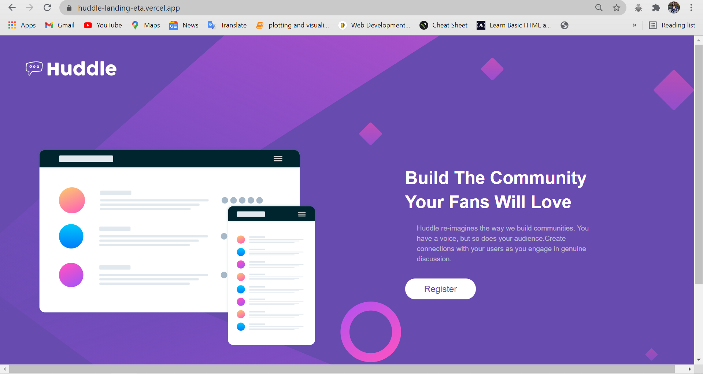

# Frontend Mentor - Huddle landing page with single introductory section

This is a solution to the [Huddle landing page with a single introductory section challenge on Frontend Mentor](https://www.frontendmentor.io/challenges/huddle-landing-page-with-a-single-introductory-section-B_2Wvxgi0/hub/huddle-page-landing-using-css-grid-n3-cBrj7C). Frontend Mentor challenges help you improve your coding skills by building realistic projects. 

## Table of contents

- [Overview](#overview)
- [The challenge](#the-challenge)
- [Screenshot](#screenshot)
- [Links](#links)
- [My process](#my-process)
- [Built with](#built-with)
- [What I learned](#what-i-learned)
- [Continued development](#continued-development)
- [Useful resources](#useful-resources)
- [Author](#author)

## Overview
Completed challenge using CSS Grid and bootstrap 

### The challenge

Users should be able to:

- View the optimal layout depending on their device's screen size

### Screenshot



### Links

- Solution URL: [https://github.com/mansi05041/huddle-landing-page.github.io]
- Live Site URL: [https://huddle-landing-eta.vercel.app/]

## My process

I use bootstrap for responsive part. 

### Built with

- Semantic HTML5 markup
- CSS custom properties
- Mobile-first workflow
- Bootstrap

### What I learned

```css
.btn:hover{
   background-color: hsl(300, 69%, 71%);
   color:#fff;
}
```
I learned hover for button. 


### Continued development

Still need improvement with allignment & responsive part

### Useful resources

- [Bootstrap](https://getbootstrap.com/) - This helped me in columns breakpoint & grid.
- [fontawesome](https://fontawesome.com/) - This provide amazing logo for social media handles.

## Author

- Frontend Mentor - [@mansi05041](https://www.frontendmentor.io/profile/mansi05041)
- Linkedin - [mansi joshi](https://www.linkedin.com/in/mansi-joshi-663aa81a0/)


